# OpenArti — Architecture Design

---

## 1. High-Level Architecture

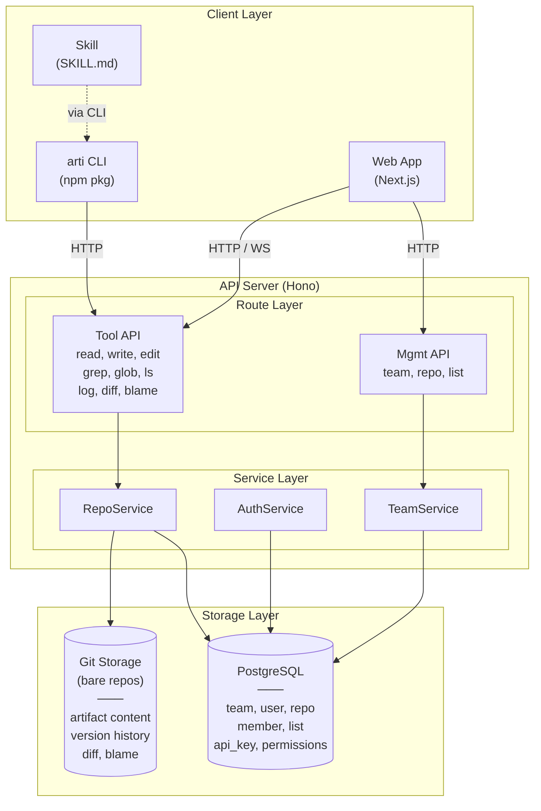

---

## 2. Key Design Decisions

### 2.1 Git as Content Storage Engine

All artifact content is stored in **bare git repos**, not in the database.

**Why:**
- The spec requires commit, diff, blame, log, rollback — all native git capabilities, zero extra implementation
- Every write = a git commit, version history is automatic
- Blame is line-level, naturally supports multi-Agent collaboration tracing
- Self-hosting only needs git + PostgreSQL, extremely low barrier

**Git operations:** The server uses git plumbing commands (no libgit2 bindings), keeping things simple and reliable. Key operation mappings:

| Tool API | Git Operation |
|----------|---------|
| `read` | `git show HEAD:<path>` |
| `write` | `hash-object` → `read-tree` → `update-index` → `write-tree` → `commit-tree` → `update-ref` |
| `edit` | read → string replace → same as write flow |
| `grep` | `git grep` |
| `glob` | `git ls-tree` + pattern match |
| `ls` | `git ls-tree` |
| `log` | `git log` |
| `diff` | `git diff` |
| `blame` | `git blame` |

**Concurrent write strategy:** Optimistic concurrency + CAS (compare-and-swap), no locks.

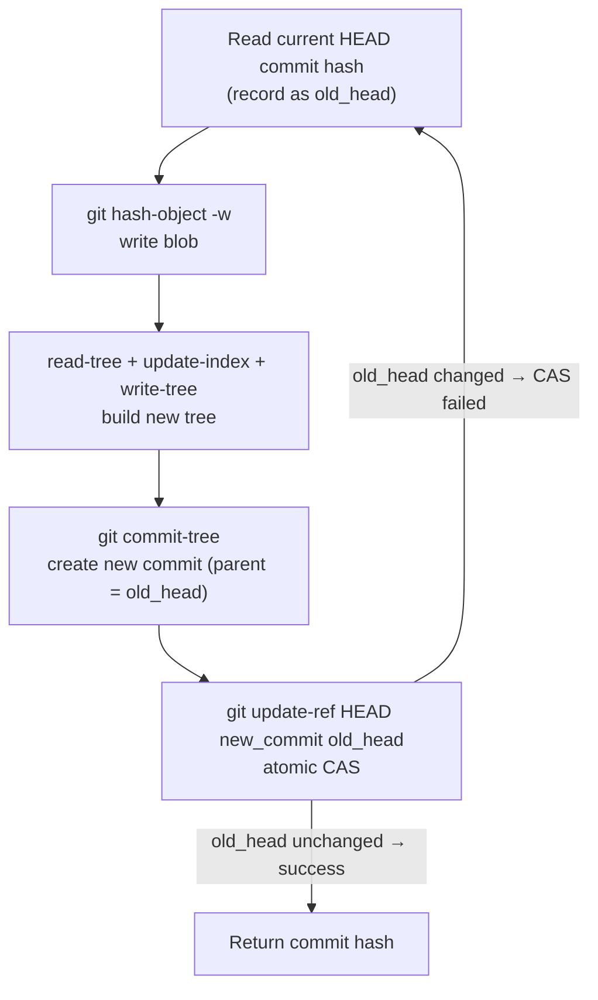

Concurrency scenarios:

| Scenario | Result |
|------|------|
| Concurrent writes to **different files** | CAS-failed side retries, rebuilds tree from new HEAD → both writes preserved |
| Concurrent edits to **same file, different locations** | Retry applies string replace on new content → both edits preserved |
| Concurrent edits to **same file, same location** | Retry finds old_string no longer matches → returns 409 conflict |

No file locks or mutexes anywhere. `update-ref` atomicity guarantees correctness. Write conflicts are rare (agents rarely edit the same line simultaneously), and when they do occur, the error semantics are clear.

**Filesystem layout:**

```
/data/repos/
  {team_name}/
    {repo_name}.git/     ← bare git repo
```

### 2.2 PostgreSQL for Metadata

Git handles content only. Team, User, Repo metadata, API keys, and permission relationships are stored in PostgreSQL.

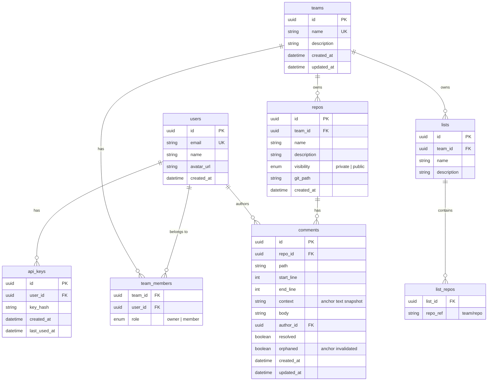

### 2.3 Hono as API Framework

Why Hono over Express/Fastify:

- **Lightweight**: zero dependencies, fast startup
- **Multi-runtime**: same code runs on Node (self-hosting) and Cloudflare Workers (Cloud)
- **TypeScript-first**: type-safe routing and middleware
- **Web standards**: based on Request/Response, no framework lock-in

Cloud deployment can migrate directly to edge runtimes without rewriting.

### 2.4 Next.js as Web Framework

- SSR: public repo artifact pages need SEO
- React ecosystem: rendering engine uses React components (Markdown, Mermaid, JSX sandbox, etc.)
- API Routes: during development, API and Web can coexist; separate later

### 2.5 Real-time Updates

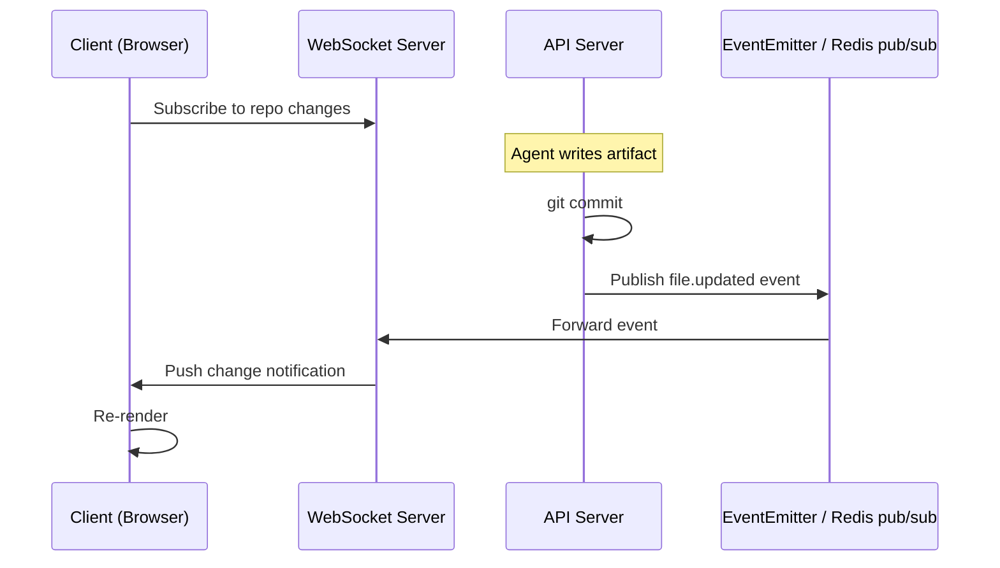

Single-instance deployment (self-hosting) doesn't need Redis — in-memory EventEmitter suffices. Multi-instance Cloud deployment introduces Redis pub/sub.

---

## 3. Monorepo Structure

```
openarti/
  apps/
    api/                    ← API server (Hono + Node)
      src/
        routes/
          tools.ts          ← Tool API (read, write, edit, grep...)
          repos.ts          ← Repo management API
        services/
          git.ts            ← Git operations wrapper
          repo.ts
        middleware/
          auth.ts           ← API Key / Session auth
        db/
          schema.ts         ← Drizzle schema
          migrations/
    web/                    ← Web frontend (Next.js)
      src/
        app/                ← App Router pages
          [team]/
            page.tsx        ← Team home
            [repo]/
              page.tsx      ← Repo home (file list)
              [...path]/
                page.tsx    ← Artifact render page
        components/
          renderers/        ← Rendering engine
            markdown.tsx
            code.tsx
            registry.ts
  packages/
    cli/                    ← arti CLI (npm package)
      src/
        commands/           ← One file per command
        api-client.ts       ← HTTP client wrapper
    shared/                 ← Shared types and utilities
      src/
        types.ts            ← API request/response types
        errors.ts           ← Error code definitions
  skills/
    openarti/               ← Agent Skill
      SKILL.md
  docker/
    docker-compose.yml      ← One-click self-hosting
    Dockerfile.api
    Dockerfile.web
```

Package management: **pnpm workspaces**. Build: **Turborepo**.

---

## 4. Core Flows

### 4.1 Agent Writes an Artifact

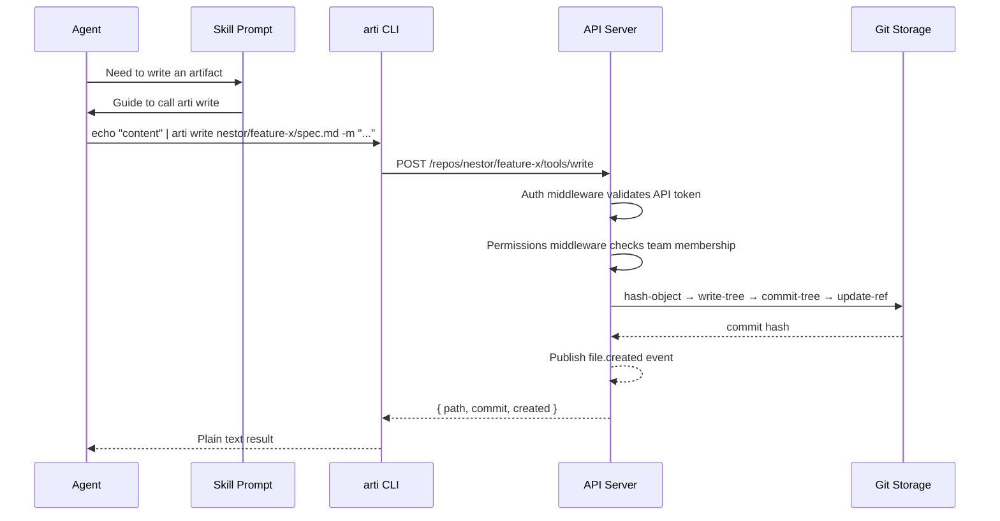

### 4.2 Web Viewing an Artifact

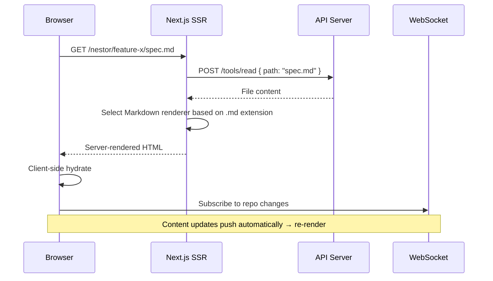

### 4.3 Edit Operation (Precise Replacement)

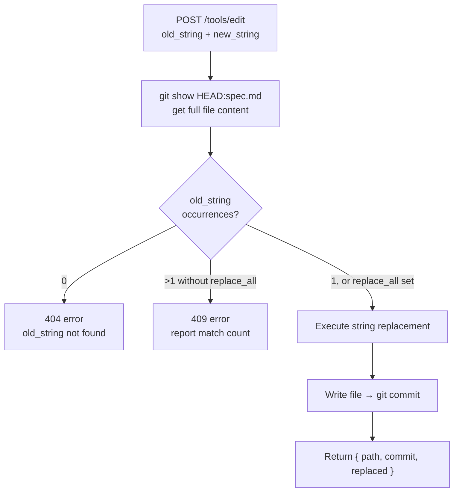

---

## 5. Authentication & Permissions

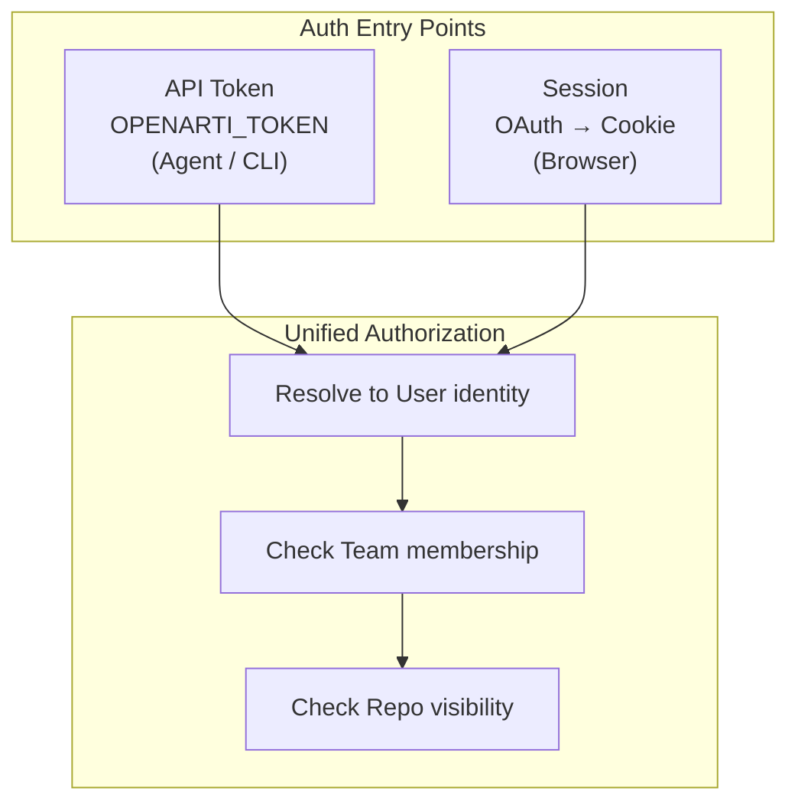

**Permission rules are simple:**
- Public repo: read operations require no auth
- Private repo: must be a team member
- Write operations: must be a team member
- Admin operations (delete repo, manage members): must be team owner

---

## 6. Tech Stack Summary

| Layer | Choice | Rationale |
|----|------|------|
| Monorepo | pnpm + Turborepo | Fast, mature, TypeScript ecosystem standard |
| API Framework | Hono | Lightweight, multi-runtime, TS-first |
| Web Framework | Next.js (App Router) | SSR + React rendering ecosystem |
| Database | PostgreSQL | Metadata storage, mature and reliable |
| ORM | Drizzle | Lightweight, type-safe, good migrations |
| Content Storage | Bare Git Repos | Version operations with zero extra implementation |
| CLI | TypeScript + Commander.js | Shares types with the project |
| Real-time | WebSocket | Simple and direct |
| Auth | API Token + OAuth (Web) | Agents use tokens, humans use OAuth |
| Deployment | Docker Compose (self-hosting) | One command to start API + Web + PostgreSQL + Git |
| CI/CD | GitHub Actions | Standard choice |
| Language | TypeScript (full-stack) | Frontend, backend, and CLI share types; single language stack |

---

## 7. Deployment Architecture

### 7.1 Self-Hosting (Single Instance)

Most self-hosting scenarios don't need multiple instances. A single instance with periodic backups can support thousands of users.

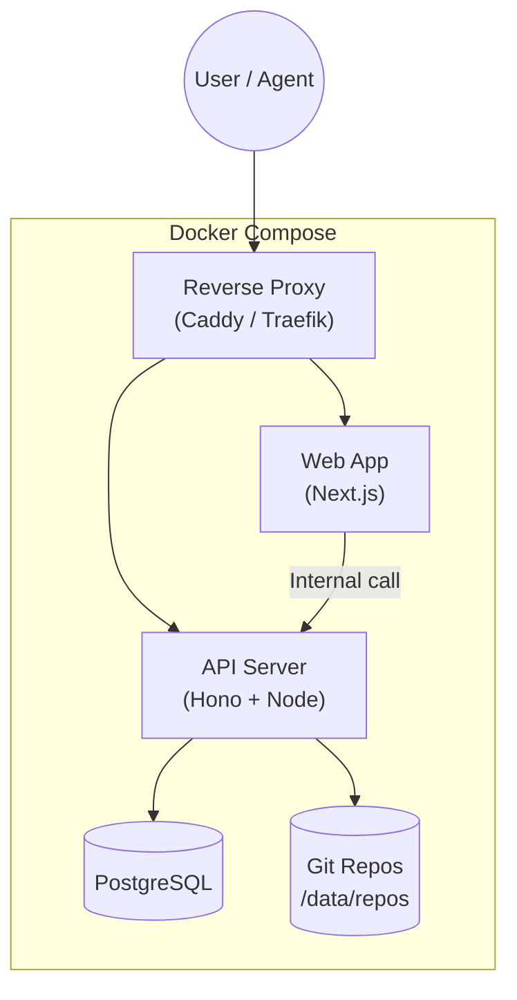

Start with: `docker compose up`. Three containers (API, Web, PostgreSQL), Git repos on a host-mounted volume. Real-time push uses in-memory EventEmitter — no Redis needed.

### 7.2 Cloud (Multi-Instance)

The core challenge with multiple instances: Git repos live on disk, multiple API instances can't each hold a copy.

Solution: extract a standalone **Git Storage Service**, making API instances stateless.

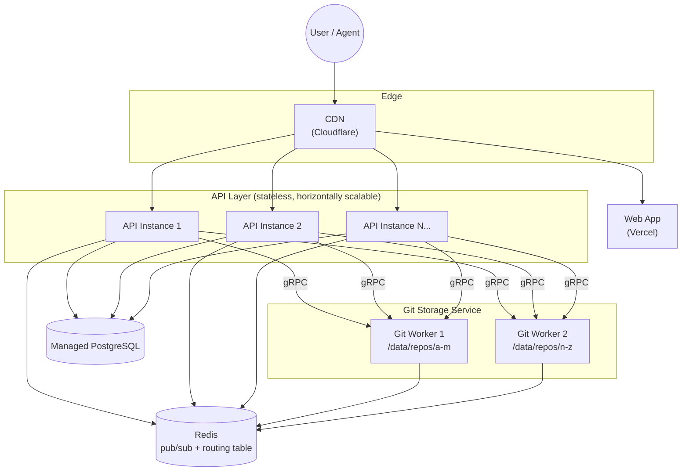

**Layer responsibilities:**

| Layer | Responsibility | Scaling |
|---|---|---|
| API Instances | Auth, permissions, request routing | Stateless, add instances horizontally |
| Git Workers | Hold bare repos, execute git operations | Sharded by team/repo |
| Redis | WebSocket event broadcast + Git Worker routing table | Single instance or cluster |
| PostgreSQL | Metadata | Managed, read-write splitting |

**API → Git Worker routing:** API receives a request, checks Redis routing table (team/repo → worker address), forwards git operations to the appropriate worker. New repos are assigned to workers by load and written to the routing table.

**Git Worker sharding strategy:** Sharded by team (all repos in a team on the same worker) for simplicity. Can later migrate hot data at per-repo granularity.

### 7.3 Comparison

| | Self-Hosting | Cloud |
|---|---|---|
| API | Single instance Node | Multi-instance stateless |
| Git Storage | Local disk, API operates directly | Git Storage Service, API calls via gRPC |
| Real-time Push | In-memory EventEmitter | Redis pub/sub |
| Database | Docker PostgreSQL | Managed PostgreSQL |
| Web | Same Docker Compose | Vercel / standalone deployment |
| CDN | None | Cloudflare |

**Code-level abstraction:** The API operates repos through a unified `GitService` interface. Self-hosting implements it as local git calls; Cloud implements it as a gRPC client. One codebase, two deployment modes.

```typescript
interface GitService {
  read(repo: string, path: string, opts?: ReadOpts): Promise<FileContent>
  write(repo: string, path: string, content: string, opts?: WriteOpts): Promise<Commit>
  edit(repo: string, path: string, edits: EditOp[], opts?: EditOpts): Promise<Commit>
  grep(repo: string, pattern: string, opts?: GrepOpts): Promise<GrepResult>
  // ...
}

// Self-hosting: direct git CLI calls
class LocalGitService implements GitService { ... }

// Cloud: gRPC calls to Git Worker
class RemoteGitService implements GitService { ... }
```

Cloud-specific features (future iterations):
- Analytics dashboard, audit logs
- SSO / SAML
- Automatic backups
- SLA + support

---

## 8. Rendering Engine Architecture

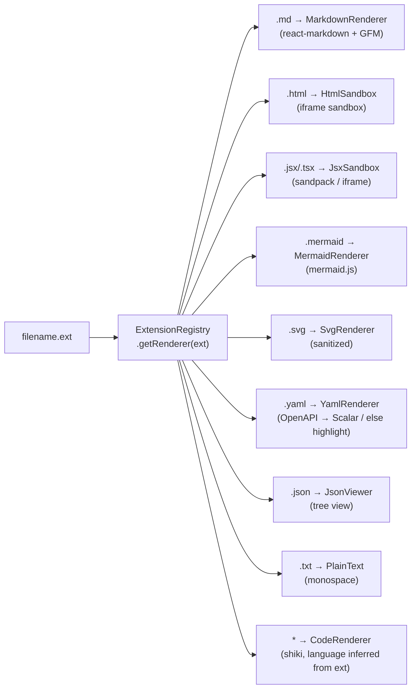

Every Renderer is a React component with a uniform interface:

```typescript
interface RendererProps {
  content: string
  filename: string
}
```

Adding a new type = write a React component + register it in the Registry.

All Renderers support switching to source mode (raw text + syntax highlighting).

---

## 9. Development Phases

### Phase 1 — Core Viability

Goal: an Agent can read/write artifacts via the Skill, and the browser can render them.

- [x] API: Tool API (read, write, edit, rm, grep, glob, ls, log, diff, blame) + Git storage layer
- [x] API: Basic auth (API Key)
- [x] CLI: All commands
- [x] Web: Artifact rendering (Markdown, code)
- [x] Skill: SKILL.md
- [x] Docker Compose self-hosting

### Phase 2 — Full Features

- [ ] API: Management API (team, repo, list)
- [ ] API: Comment system (region anchoring + Agent reads via `read`)
- [ ] Web: All renderers, version history, source/preview toggle
- [ ] Web: Comment interaction + reference copy (with location info)
- [ ] Real-time updates (WebSocket)
- [ ] OAuth login

### Phase 3 — Collaboration & Polish

- [ ] List (cross-team aggregation)
- [ ] Public repo search and discovery

### Phase 4 — Cloud

- [ ] Edge deployment
- [ ] CDN + global acceleration
- [ ] Analytics dashboard
- [ ] Billing
