# OpenArti — Architecture Design

---

## 1. High-Level Architecture

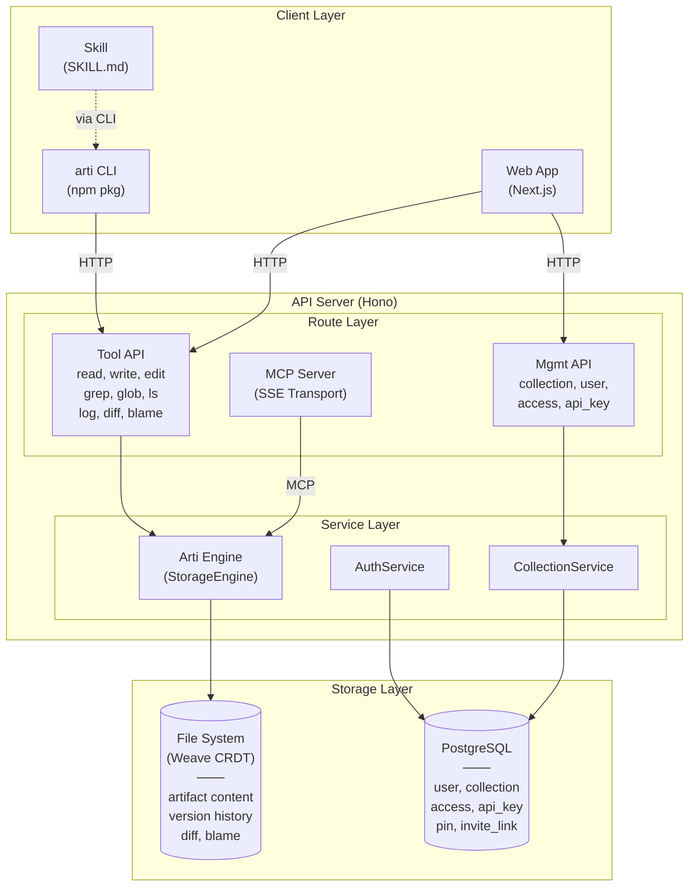

---

## 2. Key Design Decisions

### 2.1 Arti Engine — Weave CRDT Storage

All artifact content is stored on the **local filesystem** using a custom **Weave CRDT** (ported from Manyana), not in the database and not in git.

**Why Weave CRDT over Git:**
- Git is designed for human async collaboration; file-level locking breaks under agent concurrency
- Weave is a line-level CRDT — concurrent writes to the same file merge automatically, no CAS retries
- Merge is commutative and deterministic: `merge(A, B) == merge(B, A)`, always
- No external binary dependency (no `git` on the host)

**Architecture layers:**

| Layer | Responsibility |
|-------|---------------|
| `StorageEngine` interface | 12-method abstraction (read, write, edit, rm, ls, grep, glob, log, diff, blame, fileExists, init) |
| `ArtiEngine` | Implements StorageEngine using Weave + CollectionFS |
| `CollectionFS` / `LocalFS` | Pure I/O abstraction (readFile, writeFile, readdir, glob, lock) |
| Weave module | Pure functions — `initialState`, `updateState`, `mergeStates`, `serialize`, `deserialize` |

**Write flow:**

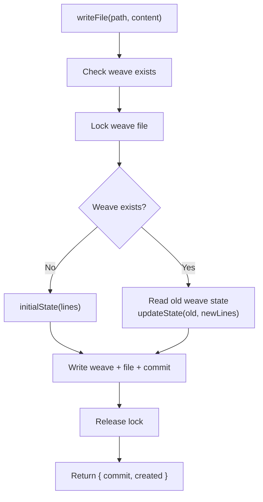

**Concurrent write strategy:** Per-file locking via weave files. Each file has its own lock, so writes to different files are fully parallel. Writes to the same file are serialized at the weave level — no conflicts, no retries.

**Commit model:** Lightweight JSON commits stored in `.arti/commits/{id}.json` with a linked-list chain via `parent` pointer. HEAD stored in `.arti/refs/HEAD`.

**Filesystem layout:**

```
/data/repos/
  {username}/
    {collection_name}.git/
      .arti/
        weaves/{path}.weave   ← Weave CRDT state per file
        commits/{id}.json     ← Commit chain
        refs/HEAD             ← Current commit pointer
      {user files}            ← Actual file content
```

### 2.2 PostgreSQL for Metadata

Arti Engine handles content only. User, Collection metadata, API keys, access control, and pins are stored in PostgreSQL. Auth is managed by **better-auth** (users, sessions, accounts, verifications).

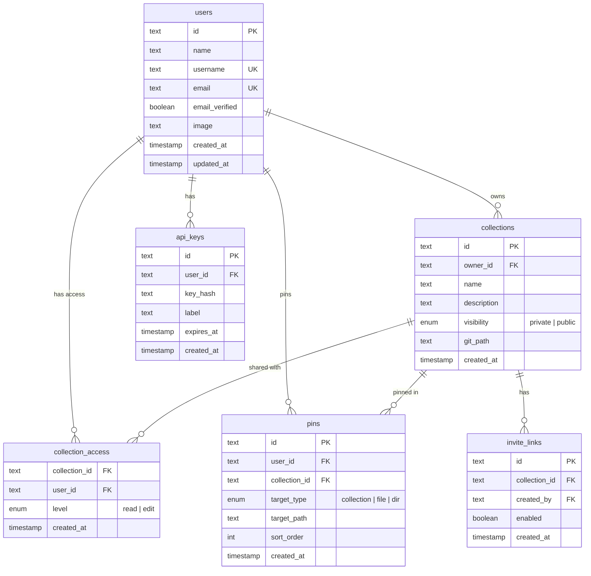

### 2.3 Hono as API Framework

Why Hono over Express/Fastify:

- **Lightweight**: zero dependencies, fast startup
- **Multi-runtime**: same code runs on Node (self-hosting) and Cloudflare Workers (Cloud)
- **TypeScript-first**: type-safe routing and middleware
- **Web standards**: based on Request/Response, no framework lock-in

Cloud deployment can migrate directly to edge runtimes without rewriting.

### 2.4 Next.js as Web Framework

- SSR: public repo artifact pages need SEO
- React ecosystem: rendering engine uses React components (Markdown, Mermaid, JSX sandbox, etc.)
- API Routes: during development, API and Web can coexist; separate later

### 2.5 Real-time Updates

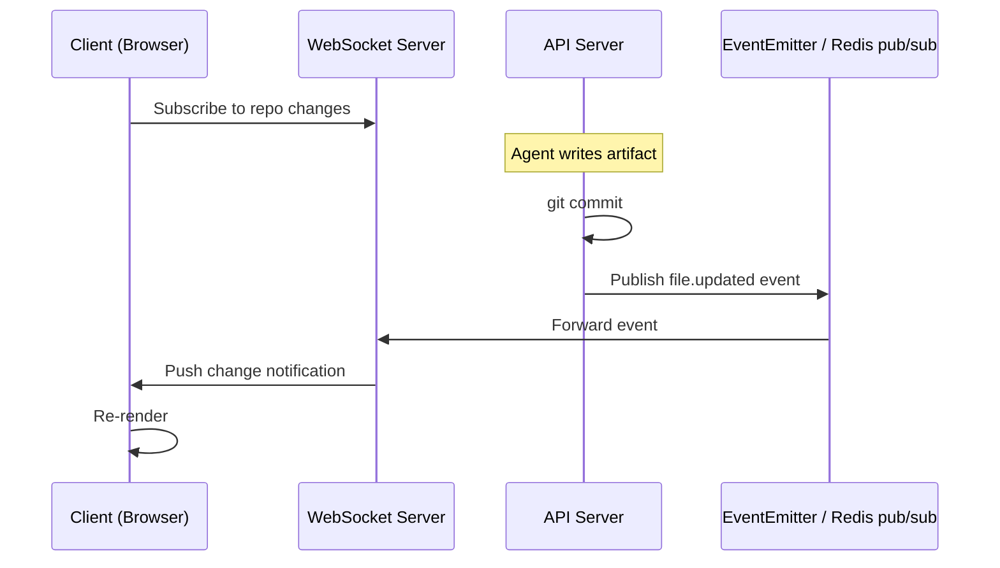

Single-instance deployment (self-hosting) doesn't need Redis — in-memory EventEmitter suffices. Multi-instance Cloud deployment introduces Redis pub/sub.

---

## 3. Monorepo Structure

```
openarti/
  apps/
    api/                    ← API server (Hono + Node)
      src/
        routes/
          tools.ts          ← Tool API (read, write, edit, grep...)
          collections.ts    ← Collection management API
        services/
          storage.ts        ← StorageEngine interface
          arti/
            engine.ts       ← ArtiEngine (StorageEngine impl)
            weave.ts        ← Weave CRDT (pure functions)
            collection-fs.ts ← CollectionFS / LocalFS
          collection.ts     ← Collection resolution & access check
          template.ts       ← Getting-started template
        mcp/
          server.ts         ← MCP server (all tools via StorageEngine)
        middleware/
          auth.ts           ← API Key / Session auth (better-auth)
        db/
          schema.ts         ← Drizzle schema
    web/                    ← Web frontend (Next.js)
      src/
        app/
          (auth)/           ← Login pages
          (dashboard)/      ← Dashboard, settings, collection browser
        components/
          renderers/        ← Rendering engine
            markdown.tsx
            code.tsx
            registry.ts
  packages/
    cli/                    ← arti CLI (npm package)
      src/
        commands/           ← One file per command
        api-client.ts       ← HTTP client wrapper
    shared/                 ← Shared types and utilities
      src/
        types.ts            ← API request/response types
        errors.ts           ← Error code definitions
  skills/
    openarti/               ← Agent Skill
      SKILL.md
  docker/
    docker-compose.yml      ← One-click self-hosting
    Dockerfile.api
    Dockerfile.web
```

Package management: **pnpm workspaces**. Build: **Turborepo**.

---

## 4. Core Flows

### 4.1 Agent Writes an Artifact

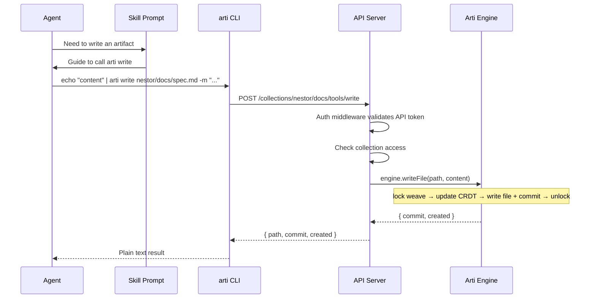

### 4.2 Web Viewing an Artifact

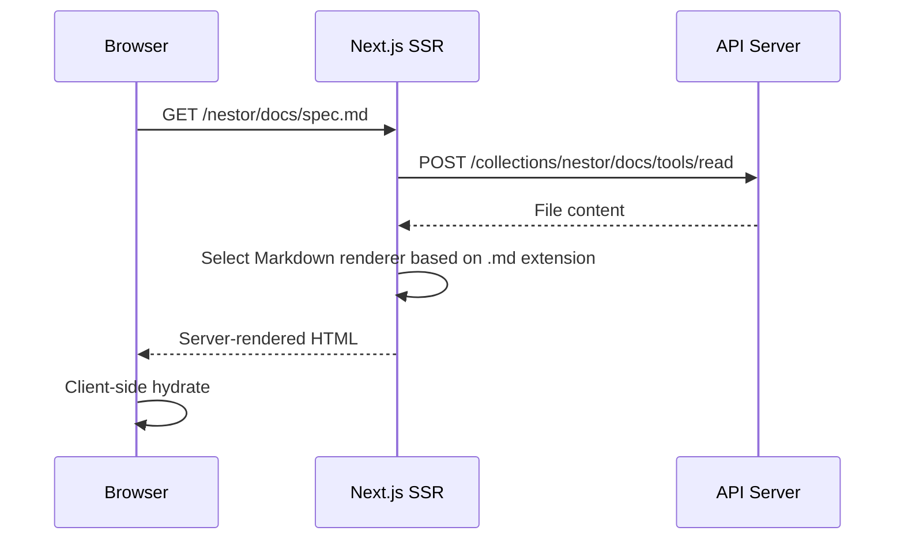

### 4.3 Edit Operation (Precise Replacement)

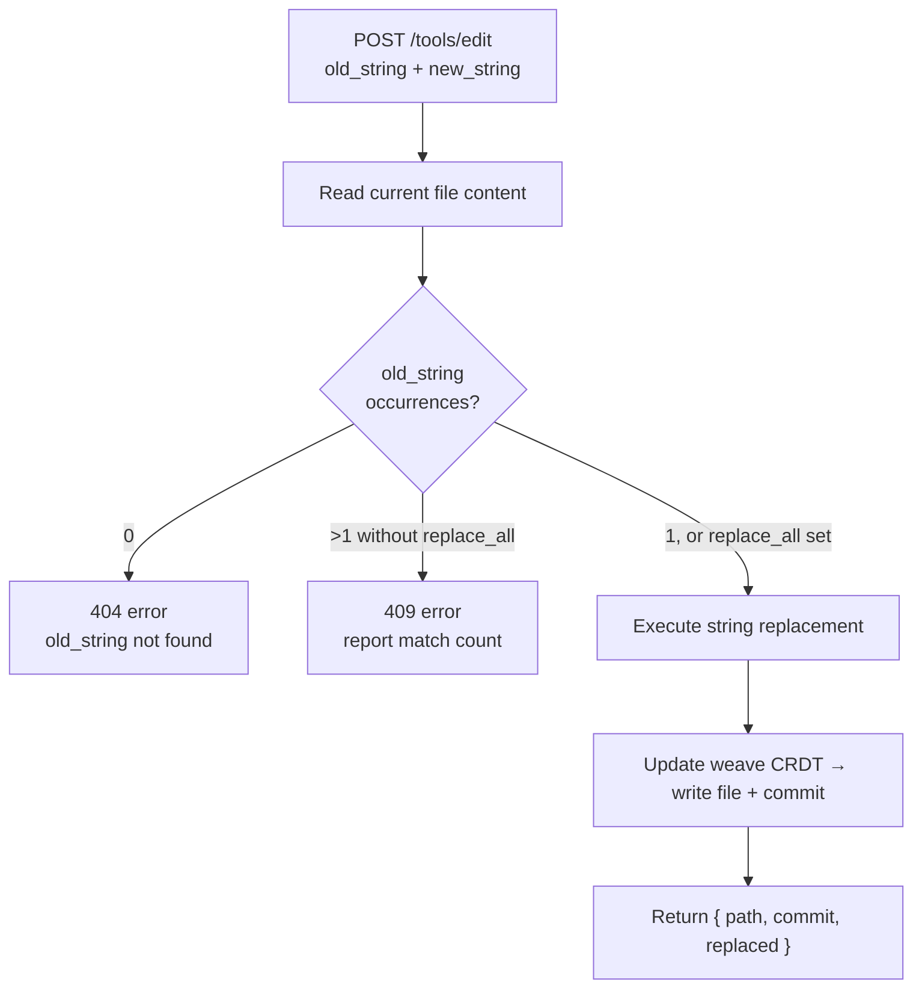

---

## 5. Authentication & Permissions

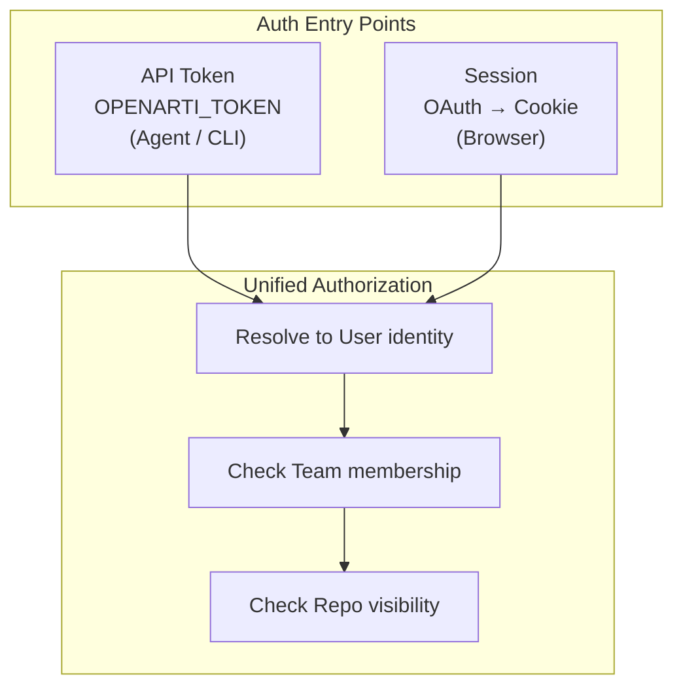

**Permission rules are simple:**
- Public collection: read operations require no auth
- Private collection: must be owner or have explicit access
- Write operations: must be owner or have "edit" access level
- Admin operations (delete collection, manage access): must be owner

---

## 6. Tech Stack Summary

| Layer | Choice | Rationale |
|----|------|------|
| Monorepo | pnpm + Turborepo | Fast, mature, TypeScript ecosystem standard |
| API Framework | Hono | Lightweight, multi-runtime, TS-first |
| Web Framework | Next.js (App Router) | SSR + React rendering ecosystem |
| Database | PostgreSQL | Metadata storage, mature and reliable |
| ORM | Drizzle | Lightweight, type-safe, good migrations |
| Content Storage | Arti Engine (Weave CRDT) | Line-level CRDT, agent-native concurrency, no git dependency |
| CLI | TypeScript + Commander.js | Shares types with the project |
| Real-time | WebSocket | Simple and direct |
| Auth | API Token + OAuth (Web) | Agents use tokens, humans use OAuth |
| Deployment | Docker Compose (self-hosting) | One command to start API + Web + PostgreSQL + Git |
| CI/CD | GitHub Actions | Standard choice |
| Language | TypeScript (full-stack) | Frontend, backend, and CLI share types; single language stack |

---

## 7. Deployment Architecture

### 7.1 Self-Hosting (Single Instance)

Most self-hosting scenarios don't need multiple instances. A single instance with periodic backups can support thousands of users.

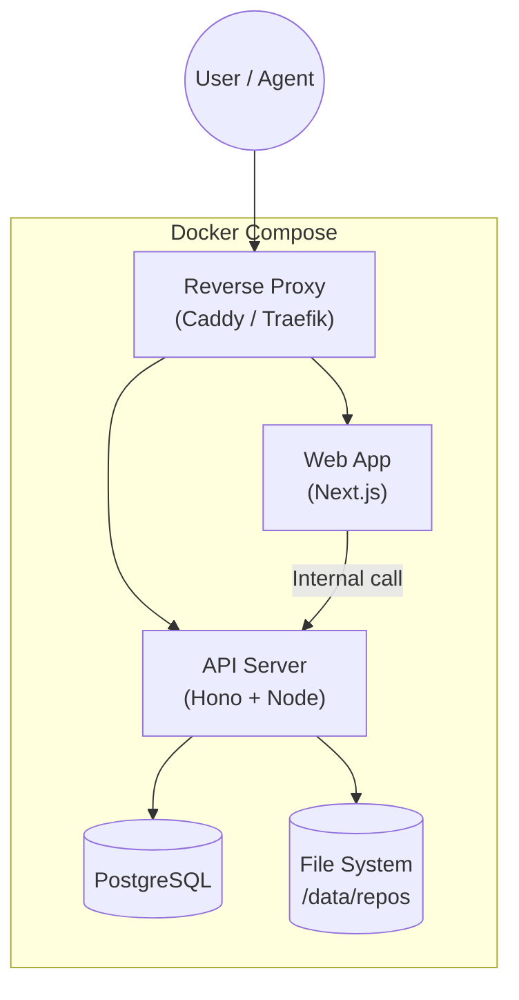

Start with: `docker compose up`. Three containers (API, Web, PostgreSQL), collection data on a host-mounted volume.

### 7.2 Cloud (Multi-Instance)

The core challenge with multiple instances: collection data lives on disk, multiple API instances can't each hold a copy.

Solution: migrate `CollectionFS` implementation from `LocalFS` (POSIX) to a shared backend (e.g. S3 + PostgreSQL). The `StorageEngine` interface stays the same — only the I/O layer changes.

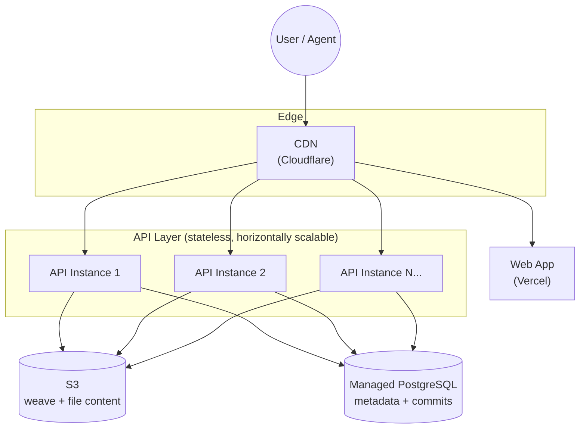

**Code-level abstraction:** The API operates collections through a unified `StorageEngine` interface. `ArtiEngine` delegates I/O to `CollectionFS`. Self-hosting uses `LocalFS` (POSIX); Cloud uses an S3-backed implementation. One codebase, two deployment modes.

```typescript
interface StorageEngine {
  readFile(collectionPath: string, filePath: string, opts?: ReadOpts): Promise<FileContent>
  writeFile(collectionPath: string, filePath: string, content: string, opts?: WriteOpts): Promise<Commit>
  editFile(collectionPath: string, filePath: string, edits: EditOp[], opts?: EditOpts): Promise<Commit>
  // ... 12 methods total
}

// CollectionFS — swappable I/O layer
interface CollectionFS {
  readFile(path: string): Promise<string>
  writeFile(path: string, content: string): Promise<void>
  readdir(path: string): Promise<DirEntry[]>
  exists(path: string): Promise<boolean>
  glob(pattern: string): Promise<string[]>
  lock(path: string): Promise<() => Promise<void>>
  // ...
}

// Self-hosting
class LocalFS implements CollectionFS { ... }

// Cloud
class S3FS implements CollectionFS { ... }
```

---

## 8. Rendering Engine Architecture

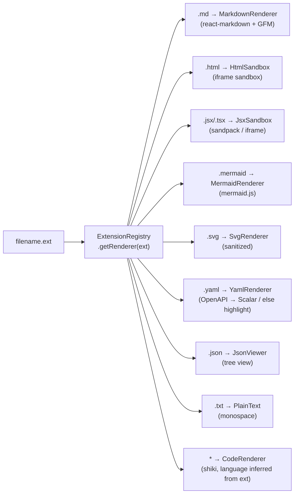

Every Renderer is a React component with a uniform interface:

```typescript
interface RendererProps {
  content: string
  filename: string
}
```

Adding a new type = write a React component + register it in the Registry.

All Renderers support switching to source mode (raw text + syntax highlighting).

---

## 9. Development Phases

### Phase 1 — Core Viability

Goal: an Agent can read/write artifacts via the Skill, and the browser can render them.

- [x] API: Tool API (read, write, edit, rm, grep, glob, ls, log, diff, blame) + Arti Engine (Weave CRDT)
- [x] API: Auth (API Key + better-auth sessions)
- [x] API: Collection management, access control, invite links
- [x] API: MCP server (SSE transport)
- [x] CLI: All commands
- [x] Web: Artifact rendering (Markdown, code, CSV, JSON, YAML, TOML, Mermaid, PlantUML, SVG, HTML, LaTeX)
- [x] Skill: SKILL.md
- [x] Docker Compose self-hosting

### Phase 2 — Full Features

- [ ] API: Comment system (region anchoring + Agent reads via `read`)
- [ ] Web: Version history, source/preview toggle
- [ ] Web: Comment interaction + reference copy (with location info)
- [ ] Real-time updates (WebSocket)

### Phase 3 — Collaboration & Polish

- [ ] Public collection search and discovery
- [ ] Weave merge for multi-device sync

### Phase 4 — Cloud

- [ ] S3-backed CollectionFS
- [ ] Edge deployment
- [ ] CDN + global acceleration
- [ ] Analytics dashboard
- [ ] Billing
