# OpenArti — Architecture

---

## 1. High-Level Architecture

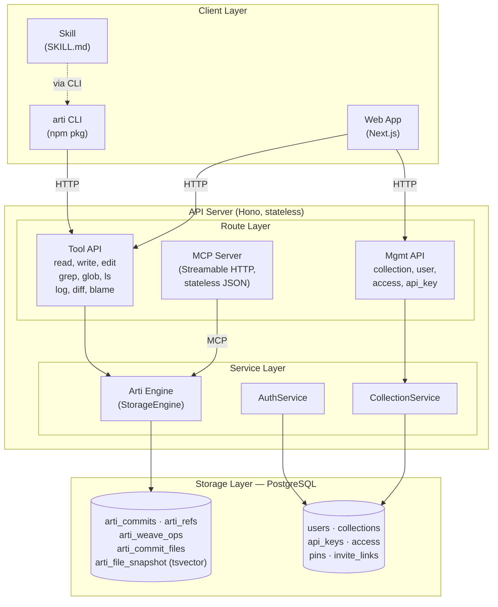

---

## 2. Key Design Decisions

### 2.1 Arti Engine — Weave CRDT on Postgres

All artifact content is stored in **PostgreSQL** using a custom **Weave CRDT** (ported from Manyana). There is no local filesystem dependency, no git, and no object store in v1 — Postgres is the single source of truth.

**Why Weave CRDT over Git:**
- Git is designed for human async collaboration; file-level locking breaks under agent concurrency
- Weave is a line-level CRDT — concurrent writes to the same file merge automatically, no CAS retries
- Merge is commutative and deterministic: `merge(A, B) == merge(B, A)`, always
- No external binary dependency (no `git` on the host)

**Why Postgres for content:**
- API processes become stateless → any instance serves any request, serverless-friendly
- Native full-text search via `tsvector` + GIN, no separate search engine for grep
- Per-file concurrency via `pg_advisory_xact_lock(hashtext(collectionId || ':' || path))` inside the write transaction — no distributed lock service
- Atomicity for free: commit row + op rows + snapshot update land in one transaction

**Architecture layers:**

| Layer | Responsibility |
|-------|---------------|
| `StorageEngine` interface | 11-method abstraction (read, write, edit, rm, ls, grep, glob, log, diff, blame, fileExists) |
| `ArtiEngine` | Implements StorageEngine via `db-ops` + `weave-ops` |
| `weave-ops` | Adapter between pure Weave CRDT and DB ops (assigns stable `lineId`, emits `insert` / `toggle` ops) |
| `db-ops` | SQL helpers: advisory lock, get HEAD, load snapshot, insert commit, upsert ops / snapshot / ref, list commits, blame attributions |
| Weave module | Pure functions — `initialState`, `updateState`, `mergeStates`, `getOpcodes`, `getDeletionsAndInsertions` |

**Write flow (all inside one transaction):**

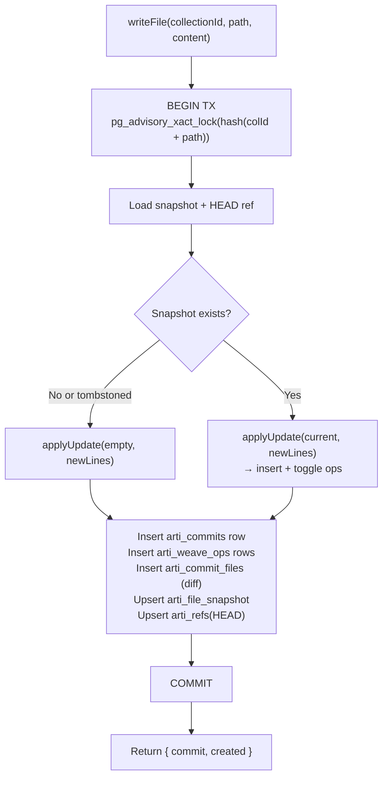

**Storage model (five tables, see `apps/api/src/db/schema.ts`):**

| Table | Role |
|-------|------|
| `arti_commits` | Commit metadata: id, parentId, author, message, timestamp, per-collection `seq` |
| `arti_refs` | Named refs per collection (`HEAD`) → commit id |
| `arti_commit_files` | Per-(commit, path) unified diff text + added/removed line counts |
| `arti_weave_ops` | Per-`lineId` op log: `insert` (text, depth, anchoredRight, insertSeq) or `toggle` (flips visibility) |
| `arti_file_snapshot` | Materialized current content + serialized weave state; `tsvector` column + GIN index for grep; `deletedAt` preserves weave for resurrection |

Reads (`readFile`, `fileExists`, `getBlame`, `grepFiles`, `globFiles`) go straight to `arti_file_snapshot` — O(1) row lookup, no log replay. History queries (`log`, `diff`) use `arti_commits` + `arti_commit_files`. Blame maps snapshot line-ids back to the `insert` op's `commitId`.

### 2.2 PostgreSQL for Metadata & Access Control

Beyond content storage (§2.1), PostgreSQL also holds all identity / permission / org data. Auth is managed by **better-auth** (users, sessions, accounts, verifications).

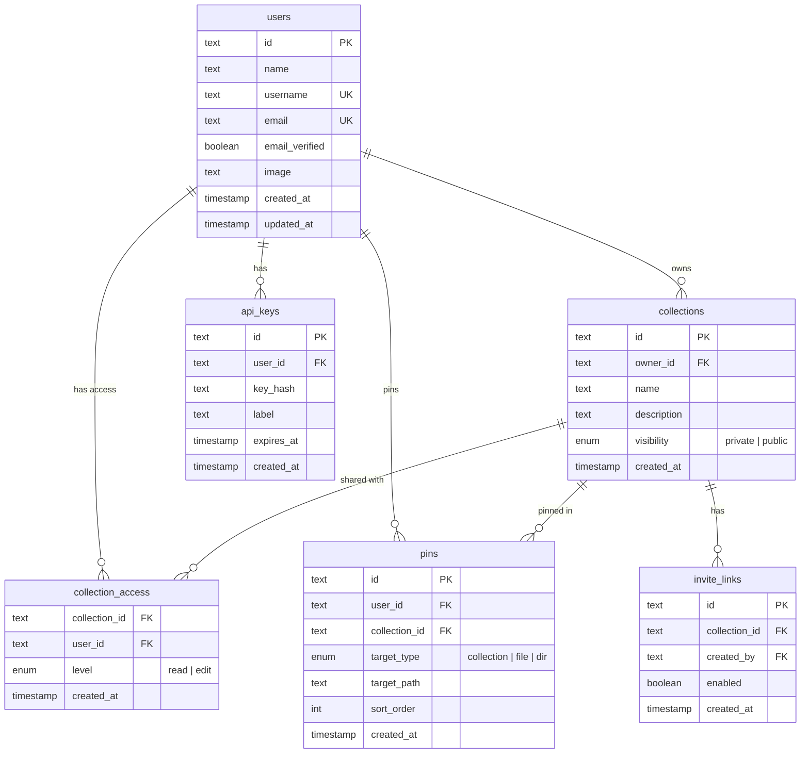

### 2.3 Hono as API Framework

Why Hono over Express/Fastify:

- **Lightweight**: zero dependencies, fast startup
- **Multi-runtime**: same code runs on Node, Cloudflare Workers, Vercel Functions, Deno, Bun
- **TypeScript-first**: type-safe routing and middleware
- **Web standards**: based on Request/Response, no framework lock-in

Combined with the MCP server running in **stateless Streamable HTTP mode** (see §2.3.1), the API has no per-process state at all — each request is independent, so the same build runs under Node containers (Fly / Railway / Cloud Run) or FaaS (Vercel Functions / Workers / Lambda) with no code changes.

### 2.3.1 MCP Server — Stateless Streamable HTTP

The MCP endpoint (`POST /mcp`) follows the 2025-03 MCP spec's Streamable HTTP transport, used in **stateless mode**: `sessionIdGenerator: undefined`, `enableJsonResponse: true`. Each POST spins up a fresh `WebStandardStreamableHTTPServerTransport` + `McpServer`, handles the JSON-RPC request, returns a JSON response, then closes.

Consequences:

- No in-memory session map → no sticky routing required
- No SSE long-lived connection → no FaaS timeout concerns (`GET /mcp` and `DELETE /mcp` return 405)
- Works the same on Workers, Vercel Functions, Lambda, and long-running Node processes
- Trade-off: server → client push (progress notifications, roots changed) is not supported. All tools in OpenArti are pure request/response, so this is not a limitation in practice.

Auth is a single Bearer API key (`oai_...`) looked up in `api_keys` by SHA-256 hash; no session cookie is involved on this endpoint.

### 2.4 Next.js as Web Framework

- SSR: public repo artifact pages need SEO
- React ecosystem: rendering engine uses React components (Markdown, Mermaid, JSX sandbox, etc.)
- API Routes: during development, API and Web can coexist; separate later

### 2.5 Real-time Updates

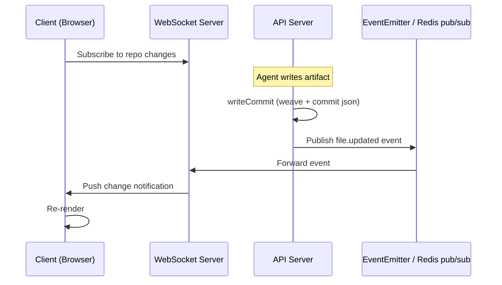

Single-instance deployment (self-hosting) doesn't need Redis — in-memory EventEmitter suffices. Multi-instance Cloud deployment introduces Redis pub/sub.

---

## 3. Monorepo Structure

```
openarti/
  apps/
    api/                    ← API server (Hono + Node)
      src/
        routes/
          tools.ts          ← Tool API (read, write, edit, grep...)
          collections.ts    ← Collection management API
        services/
          storage.ts        ← StorageEngine interface
          arti/
            engine.ts       ← ArtiEngine (StorageEngine impl)
            weave.ts        ← Weave CRDT (pure functions)
            weave-ops.ts    ← CRDT ↔ DB op adapter (lineId, insert/toggle)
            db-ops.ts       ← SQL helpers (advisory lock, snapshot, ref)
          collection.ts     ← Collection resolution & access check
          template.ts       ← Getting-started template
        mcp/
          server.ts         ← MCP server (tools via StorageEngine)
          transport.ts      ← Stateless Streamable HTTP (POST /mcp)
          oauth.ts          ← OAuth authorize flow for MCP clients
        middleware/
          auth.ts           ← API Key / Session auth (better-auth)
        db/
          schema.ts         ← Drizzle schema
    web/                    ← Web frontend (Next.js)
      src/
        app/
          (auth)/           ← Login pages
          (dashboard)/      ← Dashboard, settings, collection browser
        components/
          renderers/        ← Rendering engine
            markdown.tsx
            code.tsx
            registry.ts
  packages/
    cli/                    ← arti CLI (npm package)
      src/
        commands/           ← One file per command
        api-client.ts       ← HTTP client wrapper
    shared/                 ← Shared types and utilities
      src/
        types.ts            ← API request/response types
        errors.ts           ← Error code definitions
  skills/
    openarti/               ← Agent Skill
      SKILL.md
  docker/
    docker-compose.yml      ← One-click self-hosting
    Dockerfile.api
    Dockerfile.web
```

Package management: **pnpm workspaces**. Build: **Turborepo**.

---

## 4. Core Flows

### 4.1 Agent Writes an Artifact

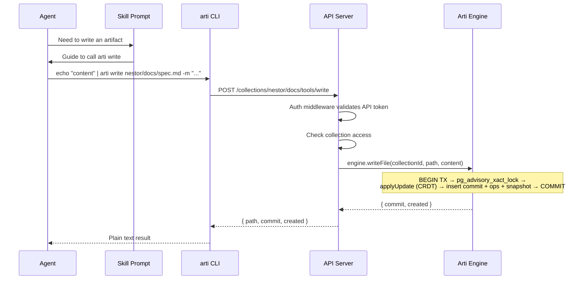

### 4.2 Web Viewing an Artifact

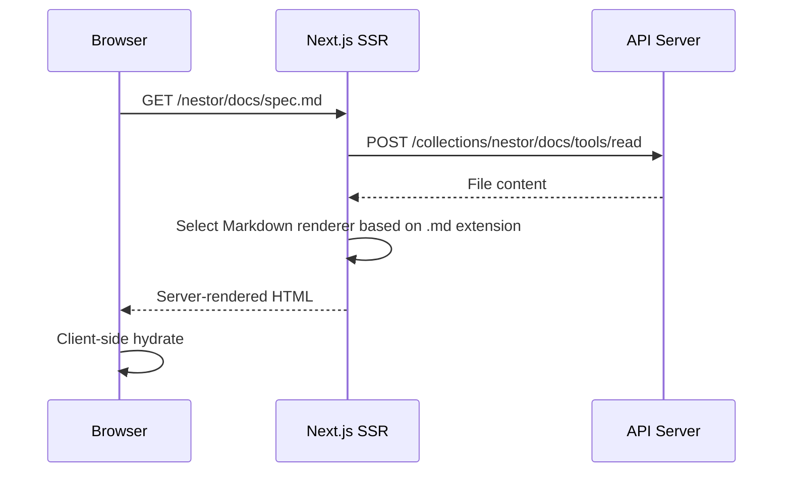

### 4.3 Edit Operation (Precise Replacement)

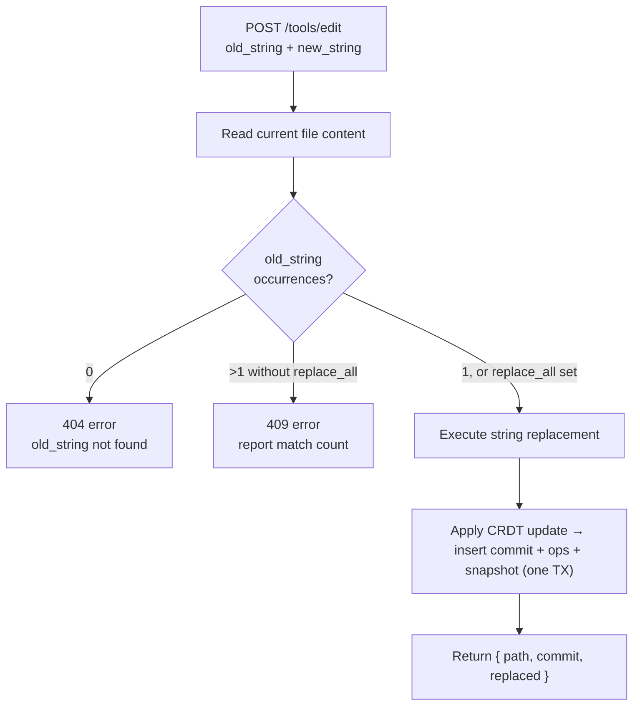

---

## 5. Authentication & Permissions

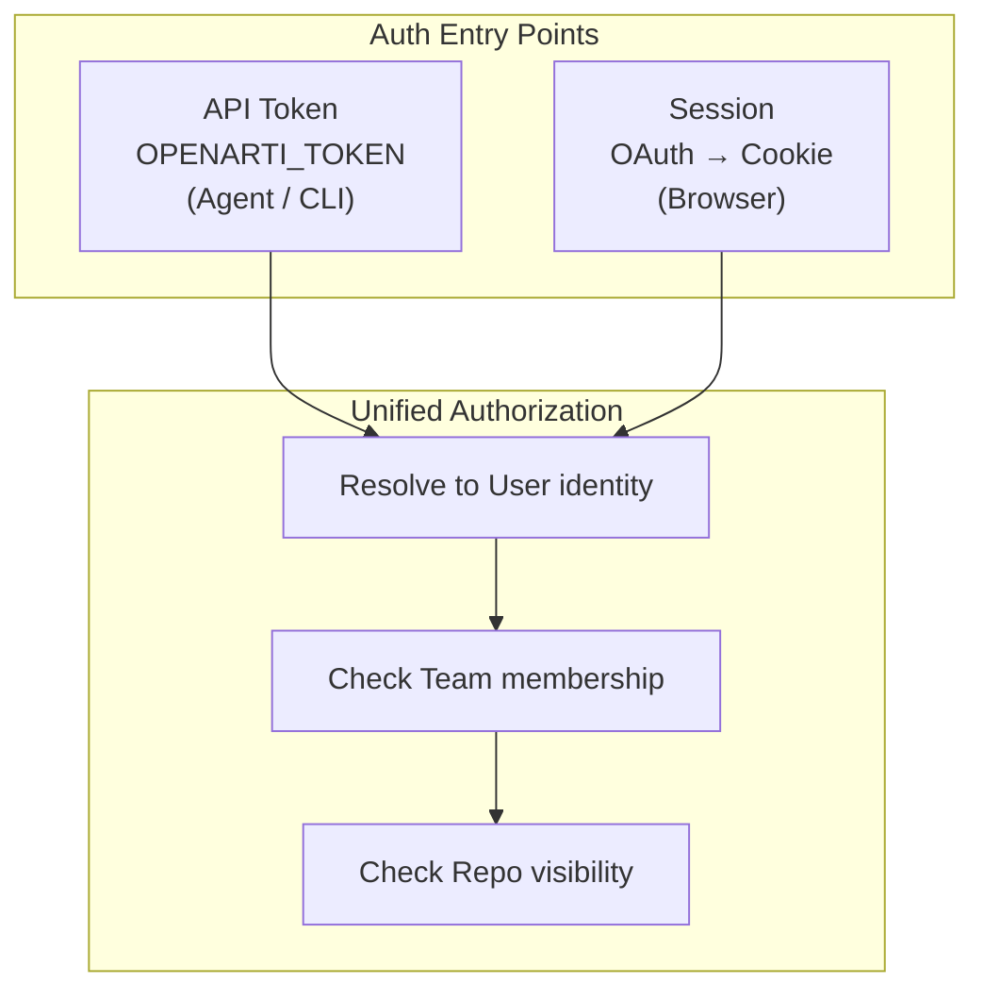

**Permission rules are simple:**
- Public collection: read operations require no auth
- Private collection: must be owner or have explicit access
- Write operations: must be owner or have "edit" access level
- Admin operations (delete collection, manage access): must be owner

---

## 6. Tech Stack Summary

| Layer | Choice | Rationale |
|----|------|------|
| Monorepo | pnpm + Turborepo | Fast, mature, TypeScript ecosystem standard |
| API Framework | Hono | Lightweight, multi-runtime, TS-first |
| Web Framework | Next.js (App Router) | SSR + React rendering ecosystem |
| Database | PostgreSQL | Single source of truth — metadata *and* content |
| ORM | Drizzle | Lightweight, type-safe, good migrations |
| Content Storage | Arti Engine (Weave CRDT over Postgres) | Line-level CRDT with `lineId` op log + materialized snapshot; native `tsvector` grep; per-file advisory lock |
| MCP | Streamable HTTP (stateless, JSON) | No session memory, serverless-friendly |
| CLI | TypeScript + Commander.js | Shares types with the project |
| Real-time | WebSocket (planned) | Not yet implemented |
| Auth | API Token + OAuth (Web) | Agents use tokens, humans use OAuth |
| Deployment | Docker Compose (self-hosting) | One command to start API + Web + PostgreSQL + Git |
| CI/CD | GitHub Actions | Standard choice |
| Language | TypeScript (full-stack) | Frontend, backend, and CLI share types; single language stack |

---

## 7. Deployment Architecture

Because all state lives in Postgres and the MCP endpoint is stateless, the API is a pure compute layer. The deployment story collapses into just two questions: **where does Postgres run**, and **where does the API run**. See `DESIGN-DEPLOYMENT.md` for the full matrix.

### 7.1 Self-Hosting (Single Instance, Docker Compose)

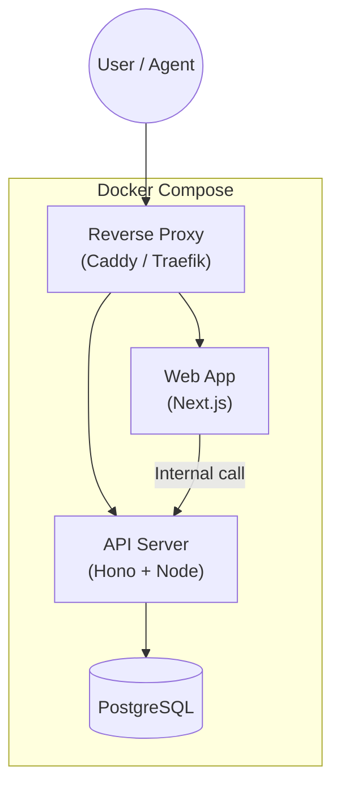

`docker compose up`. Three containers (API, Web, PostgreSQL); only Postgres needs a persistent volume. Supports thousands of users on a single box.

### 7.2 Cloud (Multi-Instance / Serverless)

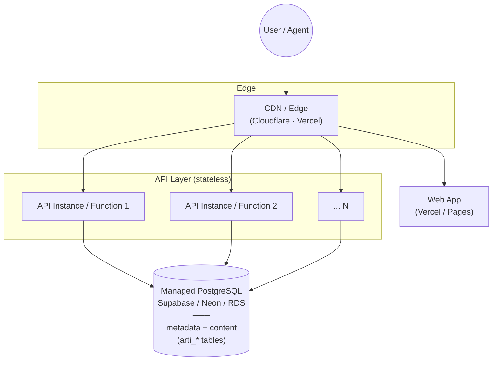

Because every request is self-contained and Postgres owns all state, three deployment shapes use the same code:

| Shape | API host | Notes |
|-------|---------|-------|
| Containers | Fly.io / Railway / Render / Cloud Run / ECS | `postgres-js` long-lived pool; simplest for steady traffic |
| Serverless | Vercel Functions / Cloudflare Workers / Lambda | Swap `DATABASE_URL` to a pooler (Supabase 6543 transaction mode) or HTTP driver (Neon serverless); zero app-code change |
| Single-box | Docker Compose (§7.1) | Self-hosting |

**No code-level pluggability needed.** All content lives in Postgres, so there is no filesystem or object-store abstraction to swap. The `StorageEngine` interface is the only public boundary:

```typescript
interface StorageEngine {
  readFile(collectionId: string, filePath: string, opts?: ReadOpts): Promise<FileContent>
  writeFile(collectionId: string, filePath: string, content: string, opts?: WriteOpts): Promise<Commit>
  editFile(collectionId: string, filePath: string, edits: EditOp[], opts?: EditOpts): Promise<Commit>
  // ... 11 methods total — see apps/api/src/services/storage.ts
}
```

---

## 8. Rendering Engine Architecture

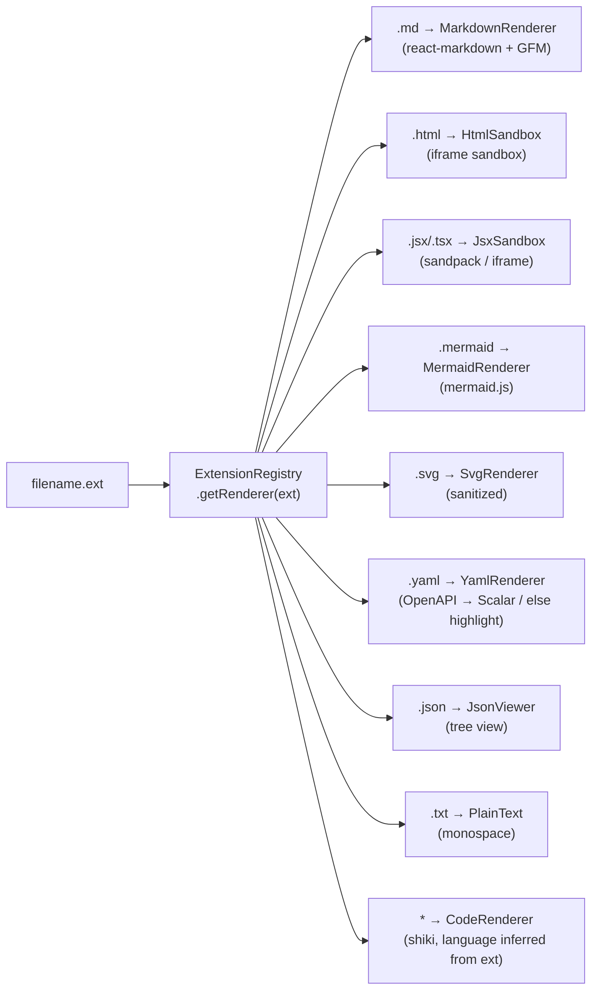

Every Renderer is a React component with a uniform interface:

```typescript
interface RendererProps {
  content: string
  filename: string
}
```

Adding a new type = write a React component + register it in the Registry.

All Renderers support switching to source mode (raw text + syntax highlighting).

---

## 9. Development Phases

### Phase 1 — Core Viability

Goal: an Agent can read/write artifacts via the Skill, and the browser can render them.

- [x] API: Tool API (read, write, edit, rm, grep, glob, ls, log, diff, blame) + Arti Engine (Weave CRDT over Postgres)
- [x] API: Auth (API Key + better-auth sessions)
- [x] API: Collection management, access control, invite links
- [x] API: MCP server (stateless Streamable HTTP)
- [x] CLI: All commands
- [x] Web: Artifact rendering (Markdown, code, CSV, JSON, YAML, TOML, Mermaid, PlantUML, SVG, HTML, LaTeX)
- [x] Skill: SKILL.md
- [x] Docker Compose self-hosting
- [x] Serverless-ready deployment path (no FS / object store / Redis dependency)

### Phase 2 — Full Features

- [ ] API: Comment system (region anchoring + Agent reads via `read`)
- [ ] Web: Version history, source/preview toggle
- [ ] Web: Comment interaction + reference copy (with location info)
- [ ] Real-time updates (WebSocket or Postgres LISTEN/NOTIFY)

### Phase 3 — Collaboration & Polish

- [ ] Public collection search and discovery
- [ ] Weave merge for multi-device sync
- [ ] Hosted Cloud: one-click deploy on Vercel + Supabase/Neon

### Phase 4 — Scale (only when needed)

- [ ] Move file content from Postgres `text` to object storage via a BlobStore abstraction (if single-file size or total volume outgrows Postgres comfortably)
- [ ] Edge deployment + CDN for public collection reads
- [ ] Analytics dashboard, billing
